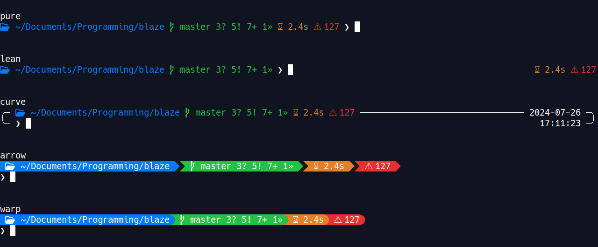

# Blaze
**A customizable and informative prompt for bash, zsh, fish, on linux distributions.**


[Installation](#installation)\
[Configuration](#configuration)\
[Builtin modules](#builtin-modules)\
[Creating your own modules](#creating-your-own-modules)\
[Removal](#removal)

## Installation
1. Download and install blaze
    ``` sh
    git clone --depth=1 https://github.com/danieltodor/blaze.git
    cd blaze
    make
    make install
    ```

2. Setup your shell\
    Make sure `~/.local/bin` is added to PATH.
    - Bash
        ``` sh
        echo 'eval "$(blaze bash --init)"' >> ~/.bashrc
        ```
    - Fish\
        Depending on your config, you should move the added line where only interactive shells will use it.
        ``` sh
        echo 'blaze fish --init | source' >> ~/.config/fish/config.fish
        ```
    - Zsh
        ``` sh
        echo 'eval "$(blaze zsh --init)"' >> ~/.zshrc
        ```

3. Configure\
Open a new shell instance to see the new prompt.\
The default prompt (1.toml) is built into blaze.
If you are not happy with it, select another config with the `./use_config <n>` command.\
For additional configuration options, check out the [configuration](#configuration) section.


## Configuration
Configuration files are read from these locations in order:
1. `BLAZE_CONFIG` env variable
2. `~/.config/blaze.toml`
3. `/etc/blaze.toml`

``` toml
# For color values you can use named values like "black" "red" "green" "yellow" "blue" "magenta" "cyan" "white".
# If your terminal emulator supports the aixterm specification, you can also use these colors with the "bright_" prefix.
# You can use color ids from 0 to 255. https://www.ditig.com/256-colors-cheat-sheet
# If your terminal emulator has truecolor support, you can also use an RGB value like "145;255;0".
# Special values:
#   - "default" The background color of the (xterm compatible) terminal emulator. Or black if the query failed.

[global]
# Whether to add a new line before the prompt is rendered
new_line = false
# This will be added before and after the string in each module
padding = " "

[prompt]
# This is your PS1
string = " "
# Foreground color to use
foreground = ""
# Foreground color to use when the last command was exited with non zero code. Use only if different from foreground
error_foreground = ""

[connector]
# This character will be used as spacing between the left and right side modules
character = " "
# Foreground color to use
foreground = ""
# Background color to use
background = ""
# Text styling to use
dim = false

[[module]]
# Name of a builtin module.
name = ""
# Execute a user defined module
execute = ""
# Which level the module should be displayed on (required only for multilevel prompt)
level = 1
# The position of the module (if omitted, modules will be displayed as they appear in config)
position = 1
# Display it on left/right side. Or display it as right_prompt if the shell supports it.
align = "left"
# Same as global one, but takes precedence over it.
padding = ""
# Displayed inside the module, before the content (foreground used as color)
inner_prefix = ""
# Displayed inside the module, after the content (foreground used as color)
inner_suffix = ""
# Displayed as the beginning of the module (background used as color)
outer_prefix = ""
# Displayed as the end of the module (background used as color)
outer_suffix = ""
# Foreground color to use
foreground = ""
# Background color to use
background = ""
# Text styling to use
bold = false
dim = false
italic = false
underline = false

[current_directory]
# Display the basename only
basename_only = false

[execution_time]
# Digits displayed after seconds
precision = 1
# Display module if execution time exceeds this
display_from = 0.0
# Display franctional part if less than this
display_fractional_until = 10.0

[git_branch]
# Ignore branches that matches these regex patterns, e.g.: "^master"
ignore = []

[git_status]
# Show the number of changes
count = true
# Spacing between the elements
spacing = " "
# Displayed when the repository is clean
clean = "✓"
# Displayed when the current branch is ahead of the remote branch
ahead = "↑"
# Displayed when the current branch is behind the remote branch
behind = "↓"
# Displayed when there are stashed files
stashed = "$"
# Displayed when there are untracked files
untracked = "?"
# Displayed when there are conflicted files
conflicted = "="
# Displayed when there are modified files
modified = "!"
# Displayed when there are staged files
staged = "+"
# Displayed when there are renamed files
renamed = "»"
# Displayed when there are deleted files
deleted = "✘"

[date]
# Date format to use
format = "%x"

[time]
# Time format to use
format = "%X"

[exit_status]
# Show exit status only if non zero
non_zero_only = false
```

## Builtin modules
| Name | Description |
| - | - |
| separator | Can be used for additional separation between modules |
| directory | Current working directory |
| execution_time | Execution time of the last command (wall time) |
| git_branch | Active branch in the repository |
| git_status | Symbols indicating the current state of the repository |
| date | Current date [(format options)](https://en.cppreference.com/w/cpp/chrono/c/strftime) |
| time | Current time [(format options)](https://en.cppreference.com/w/cpp/chrono/c/strftime) |
| user | Current user |
| host | Hostname |
| exit_status | Exit status of the last command |

## Creating your own modules
You can use the programming language of your choice to create a custom module.
1. Create a script/binary that writes something to stdout.
``` py
# Check the PWD and/or the file/directory contents, or whatever you need.
# At the end, write something to stdout.
# If stdout is empty at the end, the module and it`s prefix/suffix content won`t be displayed.
# This way you can create modules that are only used in certain directories.
print('something')
```
2. Create a new module entry in your config file, and tell blaze how and where it can be executed.
``` toml
[[module]]
execute = "python path/to/file.py"
# Additional styling like background, foreground, etc
```

## Removal
1. Delete the setup line from your shell\`s rc file.
2. cd into the downloaded blaze directory and run `make uninstall`.
3. Delete the `blaze.toml` file if you created one.
